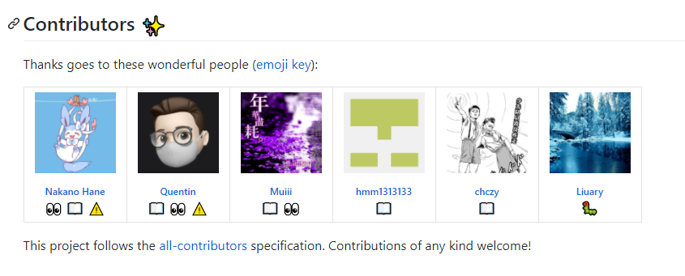
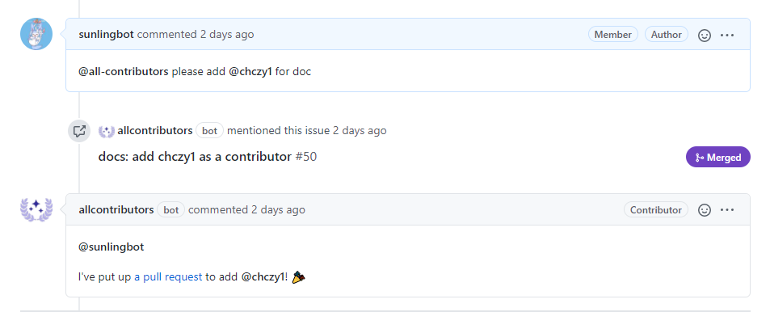

# 贡献者名单
贡献者被定义为，在项目中为之付出过的参与者，无论贡献大小与重要程度。人们花费自己的空闲时间，以各种方式为开源项目努力，因此每个人的贡献，不管是不是代码，都应该受到赞扬。

以下是本文档中列出的所有的贡献者名单和简介（请各位贡献者按照 [issue#29](https://github.com/max-studio/CMT_CS_Learning/issues/29) 的顺序在此依次补充您的名单和简介）：

[@sunlingbot](https://github.com/sunlingbot) ：现为西安电子科技大学电子系在读学生，CMT_CS_Learning 项目发起人之一，弱鸡开源人，擅长摸鱼和传销，梦想是成为巨佬们的腿部挂件！

## 使用 All-contributors-bot 自动添加贡献者

[all-contributors bot](https://allcontributors.org/docs/en/overview) 是一个 “智能的” 机器人，它被用于认可开源项目的规范，贡献不仅仅是提交代码，甚至是可以修正一个标点符号，您的贡献将会被机器人自动添加到 README 文件的 Contributors 栏目中。（就像这样！



### 使用文档

核心开发团队希望记载每个人所付出的努力，因此您的贡献不应该被遗忘，我们将为您解释 `bot` 的基本原理和使用方法：

  - 首先，当您提起 issue 或 pull request ( PR ) 时，您可以在评论区使用以下命令，召唤 `bot` 来记录您的贡献。其中，贡献类型可以在 [emoji-key](https://allcontributors.org/docs/en/emoji-key) 中找到。请注意，使用以下命令时用户名前需要添加 `@`，尖括号 `<>` 需要删除。
  
    ```Markdown
    @all-contributors please add <@用户名> for <贡献> 
    ```
  - 当按照上述格式键入评论区并提交您的 issue 或pull request ( PR ) 时。机器人就会自动向仓库提起一条 PR ，其内容就是向 README 文件自动写入 HTML 语言定义的贡献者列表模板。
    
    **特别注意：`bot` 是新建一条分支并向仓库提起 PR ，合并后请务必要删除这些分支，以免造成冲突！**

    

## 结语

以上就是 `all-contributors bot` 的使用方法，如果您仍然不会使用它，也可以在 issue 栏向管理员提出您的请求，由管理员帮助您添加到 Contributors 中！


