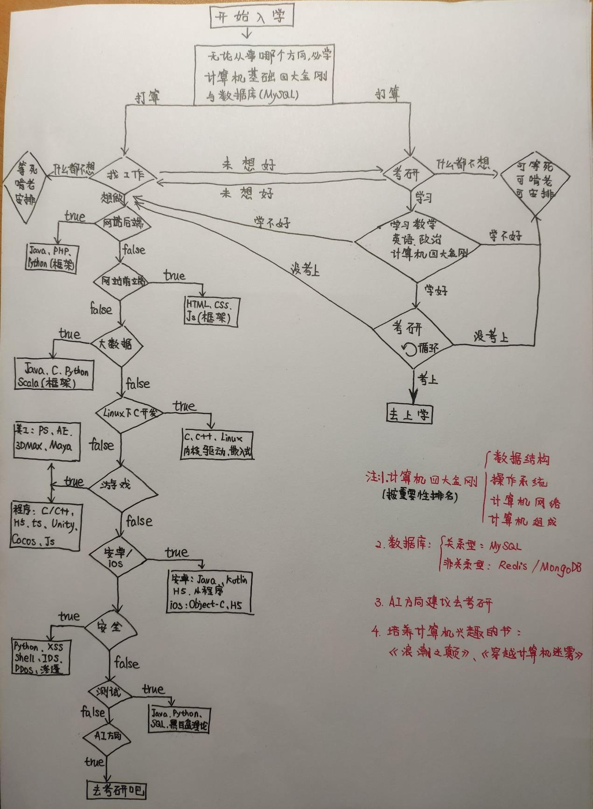

# 劝学
欢迎大家来到大数据与软件学院。在这里，你将迎来人生中最美好、最重要的一个阶段，这一阶段对大多数人来说都是无比的重要，它会决定你在未来走向社会的发展。

在没来大学前，我想你对自己的大学或多或少都有些期望，感觉怎么样呢？是不是加入了很多群，询问了很多学长学姐有关学校的情况？是不是充满自信地幻想着可以参加很多社团，认识很多很多人，能当个社长什么的？是不是幻想着可以好好学习，能拿个奖学金？

哈哈，很高兴你会有这些正能量的想法，也由衷地希望你能在这人生最美好的时光中，习得积极的人生态度、拥有真挚的友谊、收获甜美的爱情以及保持对知识的饥渴，追随智慧。

可以看到这篇文章的题目为『劝学』，因此，内容将会是沉重的，或许会给你的自信当头一棒。但本文的初衷，想以过来人的经历告诉你，大学生活里要注意的事情，如何去学习，如何在有限的自身条件下，逐步成为一个人人羡慕的“大佬”。另外，学不可以已，不要认为进入了大学就可以完全放纵自己。

## 人是如何走向平庸的

在全国大学中我们学校确实很渣，无论你是以哪种理由来到这里，但这都是**我们自己的选择**，不是吗？刚进校园的时候，你一定会听到这种话，『要是我当初再努力一下，我就是重本，要是我再来一年，我就是重本』等等。当说出这种话的时候，其实是在暴露自己的弱点，**自身学习能力的不足、遇到不满之事先找借口，而不分析自身的条件。**在这背后，深层表现出的是**性格坚毅程度的低下和极大的傲慢。**来到这里，是你对高中自身努力的交代，常言道：既来之，则安之。

也许你也时常逛论坛，或者道听途说，听到、看到大学生活的游戏度日、活动度日，情感度日，你可能会说自己进学校不会这样。这样想，是因为人在分析问题时，将自己的独立出来，以理性的主观的意识代替了盲目的群体性意识。然而，事实上，我们这样的学校甚至整个中国大学，很多人都逃不过懒惰，逃不过消极群体意识的影响，最后一步步走向平庸。对于大部分人来说，每天都是这样过得，且听一首酱油诗。

> 饱腹而卧，昏聩而起，不食早餐，先翻手机。
>
> 逢师长则都好都好，逢同侪则心高气傲。
>
> 见资料眉开眼笑，收起来转眼忘了。
>
> 盲目从众不深究，动辄大呼续一秒。
>
> 能言善辩是本领，以貌取人有说道。
>
> 该省不省，名牌气质甚高。
>
> 能拖则拖，且待心血来潮。

之后，你会发现，在这样的学校里，有一个特立独行的人出现，无论他（她）是努力读书还是繁忙的参加活动，就会有人认为他（她）是装逼，会认为他（她）只不过是跳出群体的独鸡，你特立独行，他们就会在心里自然产生对你的嫉妒和蔑视。但是，你以为自己努力学习或者参加活动，就能求得自身的完满？就能求得别人的另眼相看？不、不会，你不属于哪个群体，该嫉妒你的，会想各种事情来嫉妒你，用来表明你的努力对他来说不值一提。而对于大多数那个特立独行的你，你的本心，怕也不是真正想为了提高自己的能力，你只是想让自己变得不同，至少看起来不同，当你想要认真做一件事情的时候，你会发现自己有很多莫名的情愫，辗转反侧，心绪傲慢，**到头来只不过低效率和自欺欺人的『Fake Learning』。**

在你的宿舍里，满屋烟雾，键盘劈啪作响。你心生一丝厌恶，你拿起书本走出寝室，要跟他们划清界限，证明自己。然而你刚看了十五分钟的书，你就坐不住了。你又打开了微信，QQ，微博，刷起空间朋友圈，你看的入神。这一看，就是一小时。天色已晚，拎起书包返回寝室。『明天再学。』这时你又想到了某一个电影，你在网上找到了资源，就在烟雾和战斗的呐喊，看到了后半夜。你很后悔，想着明天早起跑步，然而你又想到了一个答案『人的睡眠必须满足八小时，不然影响效率。』于是你第二天十点才起。你看到室友还在迷糊着。你的厌恶又从心底泛起。你又打开了手机刷起朋友圈。（不信且行且看，你周围这种人大有人在，包括那些自以为在实验室学习的人）

沉迷游戏，大概是大学生走向平庸的最重要的一个原因。为什么游戏使我们沉迷？因为游戏满足了现实世界无法满足的人类需求，带来了现实世界提供不了的奖励，它们以现实世界做不到的方式教育我们，鼓励我们，打动我们，以现实世界实现不了的方式把我们联系在一起。在大学，你的周围会充满了这类在虚拟世界中找寻自我需求的人，这就是群体性消极意识的一部分。

>『中路快推！磨叽啥呢！』，『傻逼辅助』，『傻逼ADC』，『去你妈的，抢什么兵』。
>
>『快来，快来，学校有人。』，『有人打我，西北方向，98K』，『快捡空投』。

## 我们不反对游戏，反对的是无所作为、沉迷游戏。

高考是场淘汰，我们错失了这次公平的机会（也许你现在不认同高考的公平性，但随着你自己经历的事情越多，你就会发现，没有什么是比高考更公平的事了）。既然来到大学，就要面对现实，深度的反思自己，分析自身能力（优缺点），想明白自己想要做的事情，想清楚自己想要成为的人，然后付出自己必须付出的努力。物以类聚，人与群分，如果你周围充满了混日子型的人，那请尽快发挥你那想特立独行的积极性，寻找优秀的人，在学校里，MaX.计算机研究室就是一个拥有许多人才的组织。

## 学校里所谓的 『大佬』

想必你们已经接触了很多学长，听着他们给你讲着，你听不懂，听不明白的内容，品着他们给你说的大学人生哲理，你肃然起敬，而后便叫他们为『大佬』。你像一个饥渴的聆听者，想要从『大佬』那里得到很多得多的资源，信息。最后当你一融入大学的生活，就会很少或者不再联系这些人，到了下一学年你与学弟学妹们接触后，你也会被学弟叫做『大佬』。
  
有同学可能问，我们这种学校，『大佬』的水平会怎么样呢？其实可想而知，那些『大佬』，有的只不过是在某方面收一波智商税，有的吹吹牛逼就能收获一群迷弟迷妹，不过也存在一些比平常人努力的人，存在一些在职业高中就已经学习本院相关专业知识的人，存在一些因为有利条件就早早接触过计算机相关的专业知识，如果你是一个从未接触过计算机专业知识的人，你会发现你和这些人是存在差距的。因此，不可迷信『大佬』的光环而抬高自己，认为自己也能牛逼，不可迷信『大佬』的光环而贬低自己，认为自己智商很低，每个人都会走出自己的道路。入学后的要陪养个人的第一要素是 **『学会明辨』**。

## 谈谈计算机专业

我想大多数人，都是看哪个专业火，或者在家人和亲朋的劝说下，又或是受到电影中的黑客形象，又或者因为游戏，选择的计算机相关专业。那么计算机专业都会学些什么呢？从事计算机行业，其技术学习周期是非常的长，要学习内容非常的多，要懂得取舍与耐心学习。

开设的主要课程有：数学类（高等数学、线性代数、概率论、离散数学）、英语、理论专业课（数据结构、操作系统、计算机组成原理、微机原理、编译原理、计算机网络、数据库系统、软件工程、嵌入式开发、云计算等）、技术性专业课 ( C/C++语言、Java 语言、网页前端三件套、SQL 等等，大数据专业会学习到 Hadoop、Spark 等。）

你肯定会问这么多课程都能干些什么呢？这个问题，留给你们自己去解答，在这里我会推荐一些书籍，这些书籍很好的诠释了计算机专业，有趣不会让你感到生硬。

> **《编码:隐匿在计算机软硬件背后的语言》**
>
> **《穿越计算机迷雾》**
>
> **《浪潮之巅》**

1 和 2，选择其中之一即可，第一本会稍微偏理论，第二本更加贴合实际，但第一本属于全球畅销书，因此选择哪本书，就要看自己的取舍了。

## 如何选择自己想要从事的计算机方向

 如果，你读了上面两本书，你对自己大概要做什么，就会有一个大致的了解。而如果想要细致的了解，我这里将提供一张图，希望你们可以自己去了解。
 
 从哪些地方了解？招聘网站：拉钩网、Boss直聘；程序员的网站：CSDN、牛客网

 

## 要参加的有含金量的比赛

ACM、蓝桥杯和其他各省的算法比赛。这些比赛旨在展示大学生创新能力、团队精神和在压力下编写程序、分析和解决问题能力的竞赛。（算法竞赛为主）

中国大学生程序设计大赛（安卓程序、网页程序为主）。

阿里天池大数据、泰迪杯大数据、Kaggle（大数据、AI为主）

华为ICT大赛 （计算机网络为主）

## 大学里要考的一些证 

 必须：四级英语、计算机二级（如果学习方向是 C 语言，建议必考，虽然计算机系的学生能够免考）

 建议项：软考（初级）、六级英语、驾照。

 含金量非常高的备选项：HCIE（有各个方向，可自学网上有免费视频）、红帽认证

## 终

由衷的希望，你的大学过的非常充实和美好。最后引用鲁迅的一段话，送给大家。

>愿中国青年都摆脱冷气，只是向上走，不必听自暴自弃者流的话。能做事的做事，能发声的发声。有一分热，发一分光。就令萤火一般，也可以在黑暗里发一点光，不必>等候炬火。此后如竟没有炬火，我便是唯一的光。   

---
作者：[Zhang-Yixuan](https://github.com/Zhang-Yixuan)
校对：[sunlingbot](https://github.com/sunlingbot)

本文著作权及其相关版权归属原作者 [Zhang-Yixuan](https://github.com/Zhang-Yixuan) ，使用许可 [(Creative Commons BY-SA 4.0) 知识共享署名 - 相同方式共享 4.0 国际许可协议](https://creativecommons.org/licenses/by-nc-sa/4.0/deed.zh)

