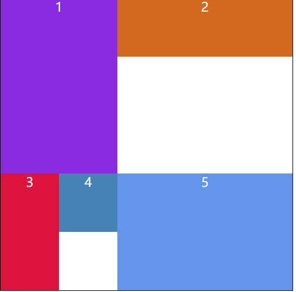
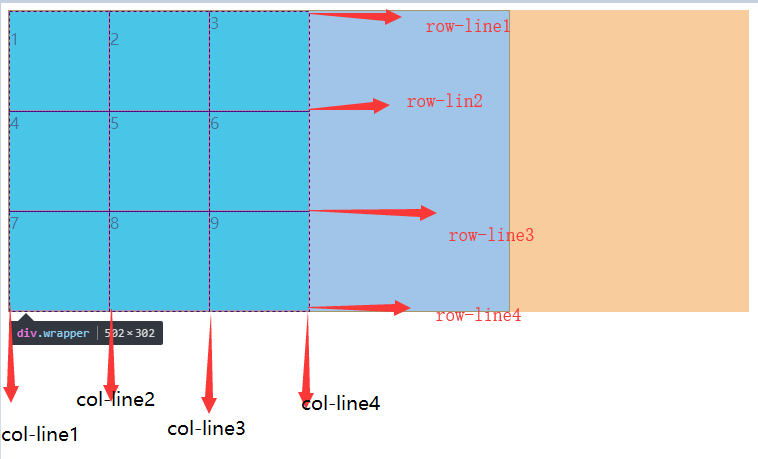
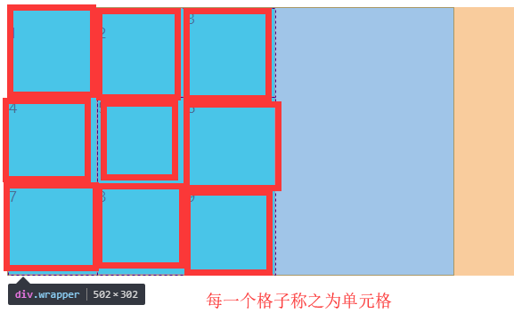

# Grid布局

网格布局(grid)作为css3的产物，在目前css布局方案中,它可以算得上是最强大的布局方案了。它更加贴近网页设计师所使用的布局策略，学习并利用好它可以让我们免受很多布局困扰。

## 一. Grid网格布局特点：

 grid布局是将网页划分成一个个网格，可以任意组合不同的网格，做出各种各样的布局。

## 二. Grid网格布局与flex的区别：

flex是流式布局，会按照轴进行排列，如果侧轴方向的大小不统一，则侧轴方向就会有空白处例如：

​    

grid网格布局是按照网格结构排列如下：

​    

## 三. 基础概念

### 容器

将父容器的盒模型设置为`grid` 或者 `inline-grid`，这样就能触发渲染引擎的网格布局算法，里面的子项目就会

```css
.father {
    display: grid | inline-grid;
}
```

1.  `grid`：表示把元素定义为块级网格元素，单独占一行;
2.  `inline-grid`：表示把元素定义为行内块级网格元素，可以和其他块级元素在同一行。

### 网格线：

使用Grid布局在显式网格中定义轨道的同时会创建网格线。网格线有水平和垂网格线。正常情况下`n`行会有`n+1`根横向网格线，`m`列有`m+1`根纵向网格线。



### 行和列

>   行： 即两个水平网格线之间的空间，也就是水平轨道称为行

>   列： 即两个垂直网格线之间的空间，也就是垂直轨道称为列  

### 单元格

由水平线和垂直线交叉构成的每个区域称为单元格，网络单元格是CSS网格中的最小单元。

​    

## 四. 常见父项属性:

```css
display: grid/inline-grid; /*指定一个容器·采用网格布局*/
```


### grid-template

`grid-template ` 是 `grid-template-row`、`grid-template-column`、`grid-template-area`的简写形式。

`grid-template`定义的行和列之间用==/==分开，前面的部分是定义的==行高== 后面的部分定义==列宽==，还可以只定义区块，然后网格会根据给定的规则等比例划网格。

#### grid-template-rows 、grid-template-columns

>   rows 用来规定网格容器的每一行的高度和横向网格线的名称.
>
>   columns用来规定网格容器的每一列的宽度和纵向网格线的名称.

```css
/*rows 和 columns 语法相同*/
.father {
    display: grid;
    grid-template-rows: length | percentage | flex | repeat() | minmax(min, max);
}

```

##### length

```
非负值的长度大小。列（宽度）或者行（高度）值可以是用css绝对单位如：px、em、rem等。
```

##### percentage

```
非负值且相对于网格容器的 <百分比>%。 如果网格容器的尺寸大小依赖网格轨道的大小（比如 inline-grid ），则百分比值将被视为auto。
```

##### flex

```
非负值，用单位 fr（fraction 的缩写，意思是"分数"）。表示网格按照给定数字来等分剩余的行或者列，当我们划分的行或列单位都用fr的时候表示把网格划分出指定等分。
```

##### repeat()

```css
/*设置重复的列宽或者是行宽，多个值之间用空格隔开*/
grid-template-rows: repeat(3, 100px);	/*表示设置3行,每行行高为100px*/
grid-template-rows: repeat(2, 100px 200px)	/*表示设置四行，行高分别为 100px 200px 100px 200px*/
```

##### minmax(min, max)

表示取一个区间值最小为min 最大为max ，若max小于min则取min。

```
特列说明min-content、max-content两个值
```

>一个用来表示以网格项的最大的最小内容来占据网格轨道的关键字。
>
>一个用来表示以网格项的最大的内容来占据网格轨道的关键字。

#### grid-template-areas

这个属性的作用是给网格布局容器划分区域，并能给区域命名。

语法：

```css
grid-template-areas: "<grid-area-name> | . | none | ..." "...";
```

取值说明：

`grid-area-name`：给区域定义名称，这里主要按照行来定义用双引号或者单元号括起来代表一行，一行中多列可以定义相同的名称(代表同一个区块)或不同名称（代表不同区块），名称之间用空格分开，第二行

`.`：表示空网格区块

`none`：表示没有定义网格区块名称


### grid-gap

>   他是`grid-column-gap`和`grid-row-gap`的简写形式，如果提供一个值，那么应用于行和列的间距，如果提供两个值需要用空格分开，空格前边的是行间距，空格后边的是列间距

#### grid-column-gap、grid-row-gap

>   此属性分别定义列和列之间的间距、行和行之间的间距


### place-items

>   此属性是 `align-items`和`justify-items`的缩写形式，如果是单个值的情况下，将应用于垂直和水平对齐，如果是两个值的话需要用空格分开，前边的表示垂直对齐，后边的表示水平对齐。


一般取值：

| 属性值  | 说明             |
| ------- | ---------------- |
| stretch | 默认值           |
| start   | 靠左或者靠上对齐 |
| center  | 居中             |
| end     | 靠有或者靠下对齐 |

#### align-items

>   是指网格项目元素在单元格中的垂直呈现方式，是垂直拉伸显示，还是上中下对齐，==取值同上==

#### justify-items

>   是指网格项目元素在单元格中的水平呈现方式，是水平拉伸显示，还是左中右对齐==取值同上==


### place-content

>   此属性是 `align-content`和`justify-content`的缩写形式，如果是单个值的情况下，将应用于垂直和水平对齐==取值同上==

#### align-content

>   指的是把网格布局中的所以子项成一个整体，然后让整体在网格容器中垂直对齐，这个需要两行以上才能看到效果。==取值同上==

#### justify-content

>   指的是把网格布局中的所以子项成一个整体，然后让整体在网格容器中水平对齐，这个需要两列以上才能看到效果。==取值同上==


## 五.子项常见属性

### grid-row、grid-column(推荐使用)

>   他们是一种缩写形式，`grid-row`是 `grid-row-start`和`grid-row-end`的缩写，`grid-column`是`grid-column-start`和`grid-column-end`的缩写。中间值用`/`分割

```css
.son {
    grid-row: 1/ 4;
}
```


#### grid-column-start、grid-column-end

```
指定网格项目从哪个纵向网格线开始，到那个纵向网格线结束，同时也可以设置夸多少列
```

**语法**：

```css
grid-column-start: start-line-name | number | span number;
grid-column-end: end-line-name | number | span number;
```

1.  `start-line-name`和 `end-line-name`：表示纵向的网格线名称；
2.  `number`：表示没有给网格线起名的情况下使用数字表示；
3.  `span`：表示跨越的意思，后边的数字表示跨越几列；

#### grid-row-start、grid-row-end

>   指定网格项目从哪个横线网格线开始，到那个列横线网格线结束，同时也可以设置夸多行，==取值同上==


### place-self

>   `place-self`属性是`align-self`和`justify-self`缩写形式。第一个值指`align-self`，第二个值指`justify-self`。如果第二个值不存在，则第一个值也将用于该值。两个值之间用空格分开。==取值同下==

#### align-self

>   用于单独设置子项的垂直对齐方式


#### justify-self

>   用于单独设置子项的水平对齐方式==取值同上==
