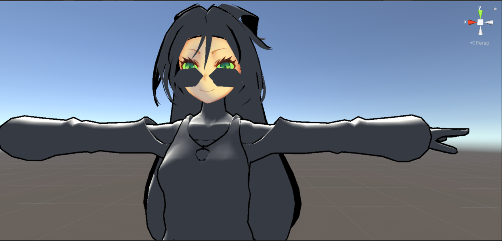
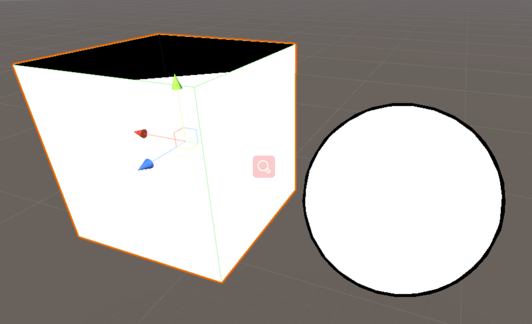
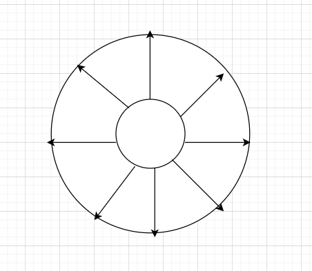
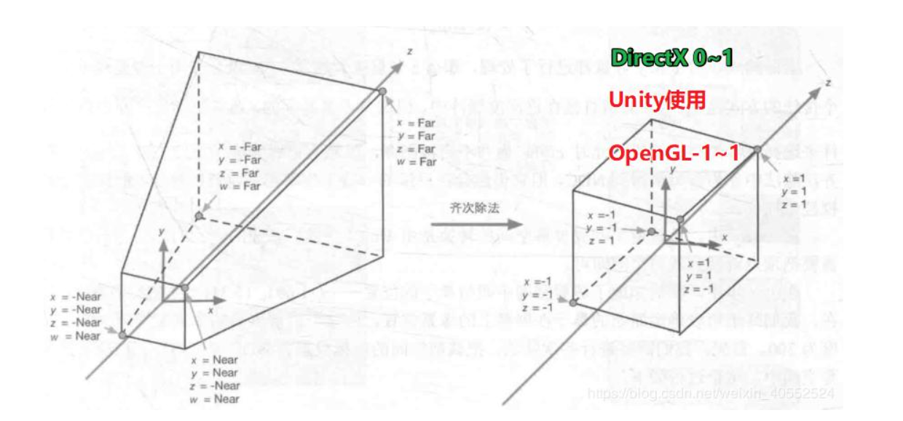
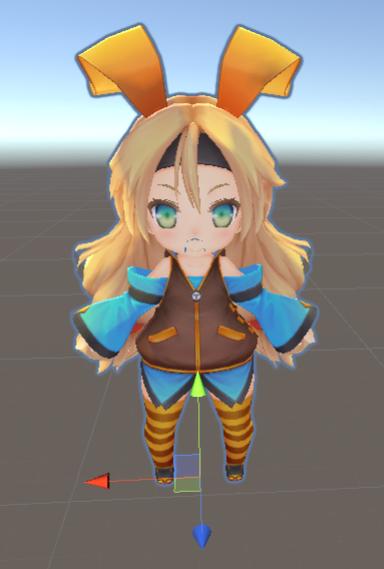
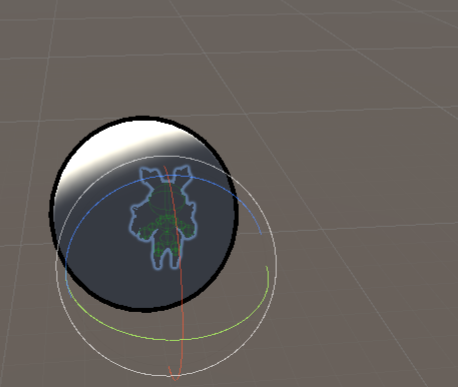

#搞点二次元——日式卡通渲染中的描边

前置知识：矩阵的运算，ShaderLab 语法

一些可能会用到的名词：
Shader：着色器，描述几何物体的着色过程。
Cg 语言：一种语法类似 C语言的着色器语言。
ShaderLab：Unity内置的着色器语言，可以内嵌 Cg 代码进行 Shader 的编写，。
法线：是指始终垂直于某平面的直线。
法向量：垂直于平面的直线所表示的向量为该平面的法向量，法向量描述了该平面的方向。

##前言
    相信大家在看漫画的时候会发现，为了区分物体与环境，漫画家通常会用黑色的线条勾勒物体的边框，而在一些 JRPG 中，人物同样在轮廓外会有黑色的线条，而这种技术，我们称之为描边。
本文适用于初学者，文中会有很多真对初学者的内容，有一定基础的人可酌情跳过，完整代码实例在同一个目录下，使用 ShaderLab 语法描述，可以直接复制到 Unity 里面使用，对 ShaderLab 熟悉的同学可以尝试理解；如果遇到实在不能理解的内容，也可以暂时跳过，等到进一步学习后再回过头来看。

图1 描边效果示意图

描边是一种在游戏开发中非常常用的技术，其原理也不是很复杂，适合初学者作为初学 Shader 时的练习素材，下面简单介绍几种描边的策略。

##一．基于视角的描边
我们想要描边，那我们首先要知道哪些地方可以称为边，基于物理常识，我们可以知道，法线与我们视野方向垂直的地方，可以称之为“边”，所以我们是否可以这样认为，边上的点的法线，一定与我的视野方向垂直？

图2 视野与某点的法线相互垂直

让我们来试一试：

图3 基于视野的描边

伪代码如下：
    outLineValue = max(0, dot(realViewDir, normal));  --点乘视野方向和法线方向，小于0的点，一定在物体背面，可以忽略
    if outLineValue < outLineHold then   --如果小于设定值，则为边，染上边的颜色，否则使用物体本身的颜色
        color = outLineColor
    else
        color = objectColor

完整 Shader 代码在本文最后，可以看到，虽然在球形上面效果看起来还勉强可以接受，但是在边缘变化不太频繁的物体上，如图2 中的立方体，可以清晰的看到，在右边有明显的黑块，这正是由于立方体的每一个面，法线方向都是一致的，所以导致了要嘛全黑，要嘛全白的效果，而且由于边是通过把模型的一部分染成黑色来实现的，所以物体的非边部分会比描边前要小一些（少的部分变成了边）。

##二．双 Z-bias 描边
所谓双 Z-bias 描边，是指将模型渲染两次，然后将第二次渲染的模型延 Z 方向进行一定的偏移，将多出来的部分作为“边”，不过这种做法相对较硬，在一些视角下会存在穿帮的现象，在这里不多赘述。

##三．法线外扩描边
法线外扩描边的基本思路是：将顶点沿着法线的方向向外移动一定距离，所形成的结果自然可以看作是“边”，但这样做会遇到一个问题，顶点的位置变了，模型也会跟着发生形变，所以，我们需要两次渲染，第一次，渲染除了边之外的其他部分；第二次，将法线外扩，得到我们想要的“边”，当然，仅仅只是扩张的模型不足以称之为边，所以，我们将在第二次渲染的时候，进行正向剔除，只渲染物体的背面，这样一来，就形成了：物体本身 + 提出了物体本身之后剩下的边 = 描了边的物体。

图4 法线外扩示意图
伪代码如下：
物体部分：
    DrawObject()
描边部分
    CUT_FRONT
    顶点：
        extendDir = normalize(TransformViewToProjection(normal.xy)  #取得归一化的 x 和 x 方向的外扩向量
        aspect = y / x
        extendDir.x *= aspect  #让 x 和 y 保持一致
        vertex.xy += extendDir * (outLineWidth)  #将顶点方向延扩张方向移动一定距离
    像素：
        return color

    如上图所示，将法线扩张之后，模型也会向外扩张，中间的小圆是物体本身，大圆是膨胀后的物体，当然，实际案例中不会扩张这么长的距离。
不过这样的策略有时也还是不满足需求，我们上述的描边方法，描出来的边的粗细，会随着距离物体的远近而缩放（有时我们想边的粗细无论在什么距离下都保持一致），而且也不会随着屏幕分辨率的改变而改变，要解决上述问题，我们需要解决：
    1.让边的粗细不随相机和模型的距离改变；
    2.粗细要考虑屏幕的分辨率，否则会出现左右和上下的边的粗细不一致的问题；
    3.上述描述没有提到过的，我们的扩张只需要考虑在二维平面上的扩张，即在视野平面上的扩张；
    4.由于是基于顶点，而不是基于像素法线的扩张，所以在Unity等引擎上会出现很多顶点与顶点之间的边会断裂，这是因为Unity等游戏引擎以Mesh描述几何物体，而Mesh由一个个三角形组成，同一个三角形的法线方向当然是一样的，这就导致了顶点与顶点之间法线的方向会有突变，这个突变就造成了边的不连续。

    我们一个个解决。
    （1、4可跳过）
    1.首先如果想要让边的粗细随物体和相机之间的距离变化而变化，我们需要清楚两个概念：世界空间和NDC空间，世界空间是指用世界坐标系描述的空间，类似于经度和纬度，世界上的任何一个地点都可以对应一份独一无二的经纬度坐标；和世界空间相对的是局部空间，比如以教室为参考系，教室的左边一个房间是教师办公室，右边一个房间是自习室，局部坐标系也是如此，以物体原点为坐标系原点；

图5 将视野空间转换为 NDC 空间

    而 NDC 空间，中文名交标准化设备坐标，从上图可以看出，在转化为 NDC 空间的过程中，我们会将坐标标准化到 [-1,1]（或者 [0,1]），而在标准化的过程中，我们可以简单的理解为，是将坐标点 (x,y,z,w)，变换成 (1,1,1,1) 的过程，这里的 z == w，所以，而 Z 在左右手坐标系中都表示深度，所以，只要我们在转换到 NDC 空间时，手动乘上这个 w，那这个点的深度就会保持不变，而深度不变，自然就表示相机和物体之间的距离不变，这样就可以让边的粗细保持自己设定的值。

    2.要想边的粗细保持各方向一致，就得考虑到此时屏幕的分辨率，否则边会被不同的屏幕拉伸成不同的粗细比率，而要想让边的粗细上下左右一致，我们需要先拿到屏幕的分辨率，我们分别取屏幕中心点距离屏幕上方的距离 y = dis_up和屏幕右方的距离 x = dis_right，然后得出分辨率，aspect = y / x, 然后将我们的向外扩张向量 extend_vector.x *= aspect，像这样，在X方向上乘上 y 方向除以X方向的值，这样子，就能够在X和Y方向上保持同样的扩张比率，这就解决了粗细不一致的问题。

    3.这个点比较好解决，在我们扩张法线的时候，只取法线的 x 和 y 两个维度的值进行运算即可。

    4.这部分其实和描边没什么关系了，要想真的让零基础的同学也能轻松理解还是有点困难，所以我只提供思路，等到几何部分学习到一定程度了可以自己实现。在计算机图形学中，想要让离散的值模拟连续的值，一个常用的方法就是做插值，在这里，我们将重复的顶点的法线做线性插值，然后将得到的结果存在顶点自身切线空间中，存储的方法可以选择存在模型的法线空间中，也可以存在切线空间中，一般会选择存在切线空间中，法线空间和切线空间各有优劣，具体原因同法线贴图的使用切线空间的原因一致，有兴趣可自行了解。

##四．其他描边策略或案例

    如果有兴趣可以了解一些其他的描边方法，比如基于梯度（梯度可以理解为图像颜色变化的剧烈程度）的描边技术，一般在物体的边缘处，梯度值会非常大，所以我们只要保留梯度值在一定数值之上的像素，就能得到物体的边，但这种方法的局限也很明显，即颜色变化不明显的边缘容易被忽略。另外一个成熟的后处理的描边方案，可以参考 URP 里面的后处理描边技术。

图6 URP 里的后处理描边效果，蓝色的为描边

图7 URP 除了描边以外还对 stencil 做了处理，使之可以显示在最上层

