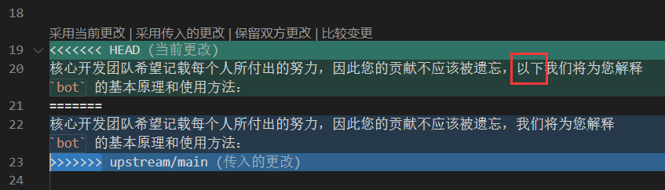
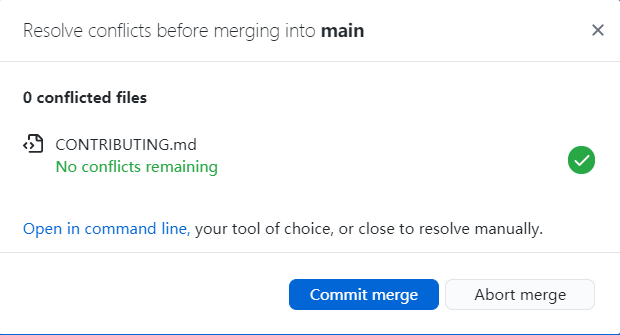

# 贡献文档

电脑前的您请不要吝啬，您的贡献一旦被合并至该仓库中，有可能会被无数学弟学妹们仰慕。

我们需要您的 Pull Requests （下文皆使用简写 PR）！

## 1. 如何贡献代码

在准备贡献代码之前，请确保您拥有 GitHub 账户，并熟悉基本的 Git 操作（add, commit, push）对自己名下远程仓库进行操作和网络通畅。

### 1.1 Fork 我们的项目 <sup>`基础`</sup>

1. 进入我们的[项目](https://github.com/max-studio/CMT_CS_Learning)首页，点击页面右上角的 fork 按钮

    

2. 点击之后，若您的账户下关联了多个组织，会出现类似的选择界面

    由于我的个人账户下，已经 fork 了我们的项目，所以拿 Vuex 项目为例，进行 fork 演示。

    

    选择您想存放的名下，第一个就是您的个人名下，其余依次是您个人账户关联的相应组织名下。

    **在我们这个项目中采取**：
      1. **fork 到自己个人名下进行工作**
      2. **确认内容无误后，再 PR 到我们仓库中**
      3. **我们会及时对您提交的内容进行一定的审核，再决定是否合并。**

    **对于所有人都是这样要求的，包括我们团队内部。**

3. 决定好放在哪个名下，点击！！！然后，静静等待 “复印机” 复刻

    

4. duang！fork 好了！

    

### 1.2 克隆并撰写您想要贡献的内容

这部分内容，如同您操作您自己“原创”的 GitHub 仓库一样。不再赘述。

大致就是：clone，coding，add，commit，push。

**但在每次撰写之前，请确保您的本地代码，跟我们仓库（上游仓库）中的内容一致，以避免合并冲突（无法自动合并）。**

如图，就是未同步上游仓库内容时的 PR 请求预检结果


**所以您要学会同步上游仓库的代码，这是您参与开源协作项目必须学会的技能。**

#### 1.2.1 如何同步上游仓库代码 <sup>`基础`</sup>

很多 `GitHub` 新手用户都会存在一个误区认知：**总是认为只要 `fork` 了仓库，就可以高枕无忧了**。其实不然，除了那些已经被列为 `Archive` 的归档项目，即核心开发者不再需要活跃贡献者提交他们的贡献、PR 和 issue 时，这时采用 `fork` 操作就相当于**一劳永逸**的做法。不过大多数开源项目还是会一直更新，我们 `fork` 的本地仓库总是在一定程度上 “落后于” 上游仓库。因此，**学会同步上游仓库代码是我们对各位贡献者做出的最基本要求！**

**如果您想标记某个优秀的开源项目，比起 `fork` 更简便和值得去做的方式，就是在该项目上标记您的 `star` 。我们提倡各位使用 `star` 的做法，不仅是为了收藏优秀的开源项目，还是为了激励开发团队们所作出的每一处努力和贡献！**

话不多说，我们现在就开始教大家如何同步上游仓库！
 
1. 在终端中打开项目地址，比如我这里是 `E:\OpenSource\CMT_CS_Learning`

   ```git
   cd "您的项目本地所在地址"
   ```

   

2. 查询当前本地仓库关联的远程仓库地址

    ```git
    git remote -v
    ```

    在您从未主动设置过 remote 相关时，它会是这样一个查询结果

    

    这时，您会发现这地址不就是您自己名下的仓库地址吗？

    但先别急着惊讶，我们还是来让您名下这仓库跟我们的仓库产生点联系

3. 为您名下的衍生仓库添加上游仓库地址

    此时，我们的仓库，对于您 fork 而来的仓库而言，可以称之为“上游（upstream）”仓库。

    上游仓库，是所有衍生（fork 而来的）仓库的源头。所以很多东西，衍生仓库都要遵从于上游仓库。

    在上游仓库有所更新的时，衍生仓库在一般情况下是需要同步这些更新的。

    特别是您要提交您的更改到上游仓库时，您须要确保衍生仓库与上游仓库的内容，除开您所更改的部分，必须保持版本内容一致。这样才能够被自动合并，不然会造成您未同步到的内容丢失，或者合并冲突。

    话不多说，我们还是来**添加上游仓库远程地址**：

    ```git
    git remote add upstream git@github.com:max-studio/CMT_CS_Learning.git

    git remote add 上游仓库自定义名 上游仓库远程地址
    ```

    这里的上游仓库名，是可以自定义的，不是非得叫 upstream。但是为了直面表达，我们建议最好还是使用 upstream。

    这时我们再执行 `git remote -v`，将多看到一点内容：

    

    在这里，再教教如何删除某个远程仓库链接，比如刚刚的上游仓库链接

    ```git
    git remote rm upstream

    git remote rm 远程仓库名称
    ```

    删除之后，记得加回去哟！不然后面的教程内容您无法继续！

4. 检查仓库当前状态！

    **警告！！！**

    **在您即将要“同步”上游仓库内容时，您必须要确保您本地代码的所有更改已提交（commit）！**

    **不然，可能会造成代码的本地合并冲突等难以解决的情况！！！请务必检查仓库当前状态**：

    ```git
    git status
    ```

5. 拉取上游仓库的更新内容

    ```git
    git fetch upstream
    ```

    

    注意，该命令，没有指定远程（`git fetch`）时，是默认拉取/下载 origin 所指向远程地址的更新。详情见 [Git - git-fetch Documentation](https://git-scm.com/docs/git-fetch)。

6. 合并刚刚抓取的 upstream 仓库 主（main） 分支。

    ```git
    git merge upstream/main
    ```

    **注意，在执行这命令的时候，请确保您本地仓库当前分支状态是在您想要与之合并的分支上。** 比如我们的项目是需要合并在 main 分支上。

    若是不在，请先执行切换分支操作：

    ```git
    git checkout main
    ```

7. 此时您就可以直接 push，或者写完您想写的内容再 commit 并 push。

### 1.3 提交 PR 请求

1. 前往您名下的衍生仓库页面。点击页面上的 **Pull requests** 选项，来到如下图所示的页面：

    

2. 再点击 **New pull request**，会来到如下图所示页面：

    

    图中所注明的地方，代表着您的合并是无冲突的，能够自动合并。这是极好的！~

3. 接着您就可以点击上图中所示的 **Create pull request**，来到下图所示页面：

    

4. 填写好请求描述/解释内容，再点击上图中所示的 **Create pull request**：

    **恭喜！您成功地提交一次 PR 请求！**

    

    之后的事情，就是上游仓库管理员的事情了。GitHub 会通过邮件的形式通知您的 PR 请求处理结果。

    您可以去喝杯咖啡，休息一下了。

### 1.4 如何解决分支合并时的冲突 <sup>`进阶`</sup>
一个使用 `Git` 协作的开源项目，往往会有许多分支在同一时刻上进行开发。 `Git` 的每次提交和合并操作，就像一条时间线一样往后延伸，这条时间线就是我们项目中的 `main` 分支。不过在实际的开发过程中，我们并不会在 `main` 分支上开发，而是会根据开发需求创建新的分支，然后在这条新分支上开发和测试，如果确定没有问题了，就可以把新分支的内容合并到 `main` 分支上。

但是有时候 `Git` 无法自动合并分支，比如你和你的同学都修改了 CONTRIBUTING.md 中的某一处代码，此时已经造成分支合并冲突，无法自动合并到 `main` 分支上。因此，解决冲突成为首要的事务！

如果您想深入地学习 `Git` 这个工具，那么提高解决合并冲突的能力，可以帮助你在今后的学习道路上走得更远。

举个栗子，管理员在上游仓库的 `main` 分支上修改了 CONTRIBUTING.md 的某处内容，而我 `fork` 的本地仓库需要使用以下命令同步上游仓库。此时返回 CONTRIBUTING.md 中存在冲突，需要我们手动去解决。


当我打开 CONTRIBUTING.md 文件，可以看到被 `<<<<<<<` 、`=======` 、`>>>>>>>` 区分的三段地方，后面的英文字母表示分支名。



`<<<<<<< HEAD` 表示的是本地仓库的内容，中间的 `=======` 表示分隔符，`>>>>>>> upstream/main` 表示上游仓库 `main` 分支上传入的更改。我们需要选择其中一个更改并提交，才能成功合并分支。此处我选择了**保留上游仓库传入的更改**，保存文件后再执行合并命令。



此时显示分支冲突已被解决，然后就可以成功合并啦！

### 1.5 结束

   **诚挚感谢您的付出，为我们的项目和开源社区贡献一份力量！**

### 1.6 参考资料

- [Github进行fork后如何与原仓库同步：重新fork很省事，但不如反复练习版本合并](https://github.com/selfteaching/the-craft-of-selfteaching/issues/67)
- [與其它開發者的互動 - 使用 Pull Request（PR）](https://gitbook.tw/chapters/github/pull-request.html)
- [GitHub Docs](https://docs.github.com/cn/free-pro-team@latest/github/getting-started-with-github)
